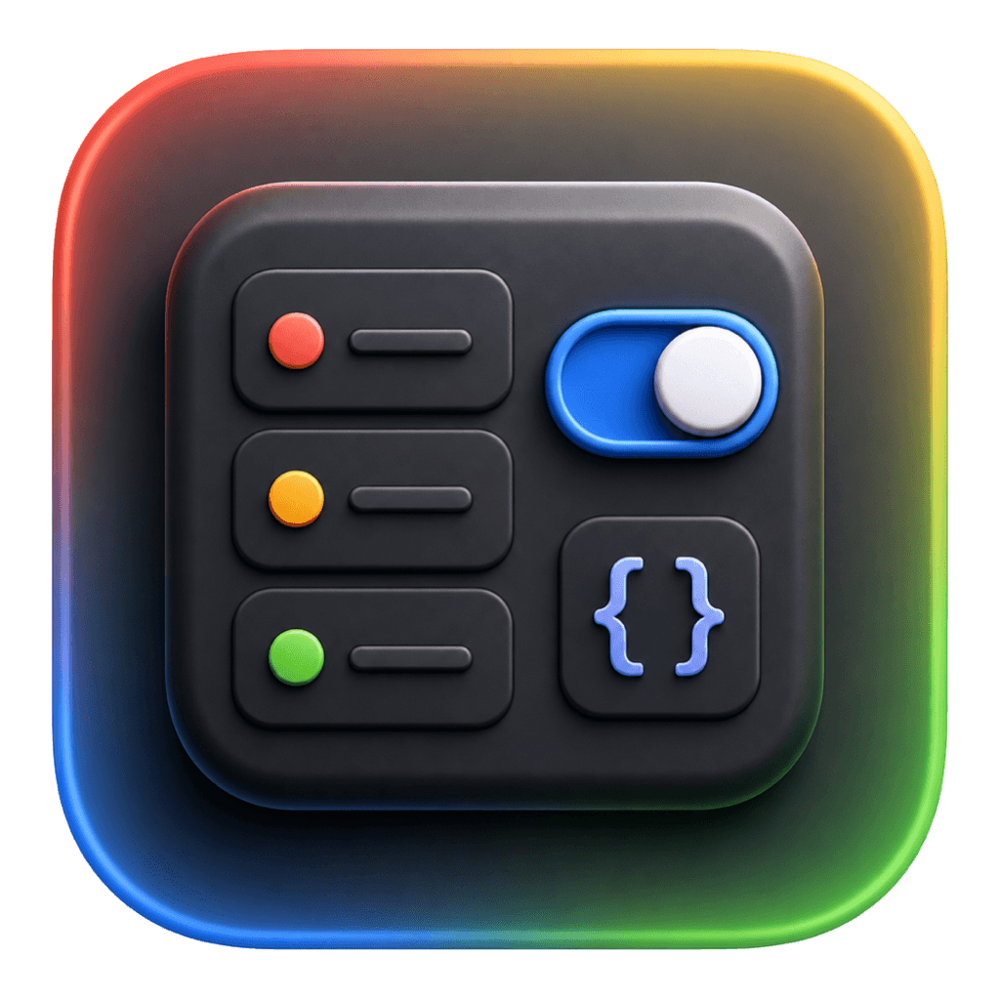

<p align="center">
  
</p>

<h1 align="center">MockKit</h1>

<p align="center">
  A native-feeling macOS workspace for managing Chrome DevTools Local Overrides.
</p>

<p align="center">
  <a href="./README.zh-CN.md">中文文档</a> ·
  <a href="https://github.com/zxpzdtom/MockKit/issues">Feedback</a> ·
  <a href="./LICENSE">License</a>
</p>

MockKit helps frontend developers turn Chrome Local Overrides into a manageable mock workspace. It scans an Overrides folder, groups endpoints, keeps multiple response cases per endpoint, and applies the active case to Chrome without running a proxy.

The app does not hook `fetch` or `XMLHttpRequest`. It manages files in the Chrome Overrides folder directly.

## Highlights

- **Chrome Overrides workspace** for binding, scanning, editing, and applying mock files.
- **Endpoint groups** with tree and list views for keeping large Overrides folders readable.
- **Multiple response cases** per endpoint, including quick switching with immediate application.
- **cURL import** for creating endpoints from browser or proxy captures.
- **AI helpers** for endpoint naming, response generation, and business-domain grouping.
- **Chinese / English UI** with local preference storage.
- **Theme presets** built from shadcn-style tokens.
- **CLI support** for scanning, importing, editing, switching cases, applying, and disabling mocks from terminal scripts.
- **App updates** through GitHub Releases, with an in-app update dialog, download progress, skip-version support, and restart-to-install.
- **Local-first storage**. App data and API keys are stored locally by default.

## How It Works

MockKit writes a hidden manifest into the Overrides folder:

```text
.mockkit-manifest.json
```

The manifest records files managed by MockKit so disabling or applying mocks does not delete unrelated files in the same Overrides folder.

By default, MockKit uses an app-owned Overrides folder:

```text
~/Library/Application Support/MockKit/Overrides
```

If Chrome DevTools already has a Local Overrides folder configured, MockKit follows that Chrome setting so Chrome and MockKit keep reading and writing the same folder.

## Chrome Setup

1. Open Chrome DevTools.
2. Go to `Sources` -> `Overrides`.
3. Select your Overrides folder.
4. Allow Chrome to access the folder.
5. Use MockKit to scan, edit, and apply response cases.

Chrome applies Local Overrides only while DevTools is open for the current page.

## Development

```bash
pnpm install
pnpm dev
```

`pnpm dev` starts Vite at `http://127.0.0.1:5173` and launches the macOS shell with `MOCKKIT_FRONTEND_DEV_SERVER` set. Frontend changes update through Vite HMR without rebuilding the app bundle.

Swift or Rust changes still require restarting the dev process.

## CLI

Build the CLI during development:

```bash
cargo build
```

Run commands directly from the debug binary:

```bash
./target/debug/mockkit status
./target/debug/mockkit list
./target/debug/mockkit search "users" --method GET
./target/debug/mockkit show "example.com/api/users"
./target/debug/mockkit group add "用户中心/账户"
./target/debug/mockkit endpoint add "example.com/api/users" \
  --name "用户列表" \
  --method GET \
  --group "用户中心/账户" \
  --body '{"users":[]}'
./target/debug/mockkit group rename "用户中心" "账号中心"
./target/debug/mockkit group reorder "账号中心" --first
./target/debug/mockkit endpoint move "example.com/api/users" --group "账号中心" --first
./target/debug/mockkit group delete "账号中心" --dry-run
./target/debug/mockkit sync
./target/debug/mockkit apply
./target/debug/mockkit import-curl "curl 'https://example.com/api/users'"
./target/debug/mockkit use "example.com/api/users" "Success"
./target/debug/mockkit case list "example.com/api/users"
./target/debug/mockkit disable
./target/debug/mockkit enable
./target/debug/mockkit disable "example.com/api/users"
./target/debug/mockkit enable --matching "users"
./target/debug/mockkit delete --group "Users" --dry-run
```

After building the app bundle, open MockKit and choose:

```text
MockKit -> Install Command Line Tool
```

New terminal windows can then run:

```bash
mockkit status
mockkit list
mockkit search "users" --group "用户中心" --enabled on
mockkit show "example.com/api/users"
mockkit group list
mockkit endpoint list
mockkit apply
mockkit use "example.com/api/users" "Success"
```

Useful options:

```bash
mockkit --json status
mockkit --store ./store.json --overrides ./overrides sync
cat request.curl | mockkit import-curl --fetch
cat users.json | mockkit case update "example.com/api/users" "Success" --body-stdin
mockkit delete --matching "deprecated" --yes
mockkit endpoint delete "example.com/api/users" --yes
mockkit group delete "用户中心" --yes
```

Resource-oriented CRUD commands are available for endpoints and groups:

```bash
# Endpoints: create, read, update, delete
mockkit endpoint add <path> [--name <text>] [--method <method>] [--group <path>]
mockkit endpoint list
mockkit endpoint show <endpoint>
mockkit endpoint edit <endpoint> [options]
mockkit endpoint move <endpoint> [--group <path> | --root] [--before <endpoint> | --after <endpoint> | --first | --last]
mockkit endpoint delete <endpoint...> [--yes]

# Groups: create, read, update, delete
mockkit group add <path>
mockkit group list
mockkit group show <path>
mockkit group rename <path> <new-path>
mockkit group reorder <path> [--before <sibling> | --after <sibling> | --first | --last]
mockkit group delete <path> [--dry-run | --yes]
```

Creating a nested group also creates its missing parent groups. Renaming or deleting a group applies recursively to descendant groups and their endpoints.

`mockkit search` and `mockkit list --matching` search names, methods, paths, descriptions, groups, tags, and every response case. Add `--regex`, `--group`, `--method`, `--enabled`, or `--limit` to narrow the result. `mockkit disable` and `mockkit enable` only change the global switch and preserve individual endpoint states; `--all` changes the global switch and every endpoint.

By default, the CLI reads the same store as the app:

```text
~/Library/Application Support/MockKit/store.json
```

Mutating CLI commands apply to Overrides immediately. `mockkit apply` is only needed to repair files after external changes.

Override paths with `--store`, `--overrides`, `MOCKKIT_STORE_PATH`, or `MOCKKIT_OVERRIDES_FOLDER`. The `--overrides` flag is scoped to the current command and does not rewrite the stored workspace path.

## Build

```bash
pnpm install
pnpm mac:build
open dist/MockKit.app
```

For release builds:

```bash
pnpm mac:build:release
```

For local update testing, build a deliberately older app version without changing repository files:

```bash
APP_VERSION=0.0.0 pnpm mac:build
open dist/MockKit.app
```

## CI and Releases

The repository has two GitHub Actions workflows:

- `CI`: runs on `main` pushes and pull requests, checks the frontend and Rust core, builds the Swift app, packages a DMG, and uploads it as a workflow artifact.
- `Release`: runs when a `v*` tag is pushed, builds the release DMG, optionally signs and notarizes it when Apple Developer secrets are configured, generates release notes from commits since the previous tag, and publishes or updates the GitHub Release.

Push normal code to `main` for automatic build verification:

```bash
git push origin main
```

Publish a version that the app can discover through the update checker:

```bash
git tag v0.1.1
git push origin v0.1.1
```

The app reads GitHub Releases for update checks, so `main` builds are useful for verification, while tagged releases are what users receive as updates.

## Project Structure

```text
Sources/ChromeOverridesManager/   macOS app shell and bundled frontend resources
frontend/                         React UI, shadcn-style components, themes, i18n
src/                              Rust core and CLI
scripts/                          Dev and app bundle scripts
assets/                           App icons and icon source images
.github/workflows/                CI build and tagged release automation
```

## Limits

- Chrome Overrides matching follows Chrome's own rules.
- Status code and headers are stored in the app model, but the first apply path focuses on response bodies.
- Same URL with different HTTP methods may not be distinguishable by Chrome Overrides.
- You may need to refresh the page after applying a case.

## License

MIT
