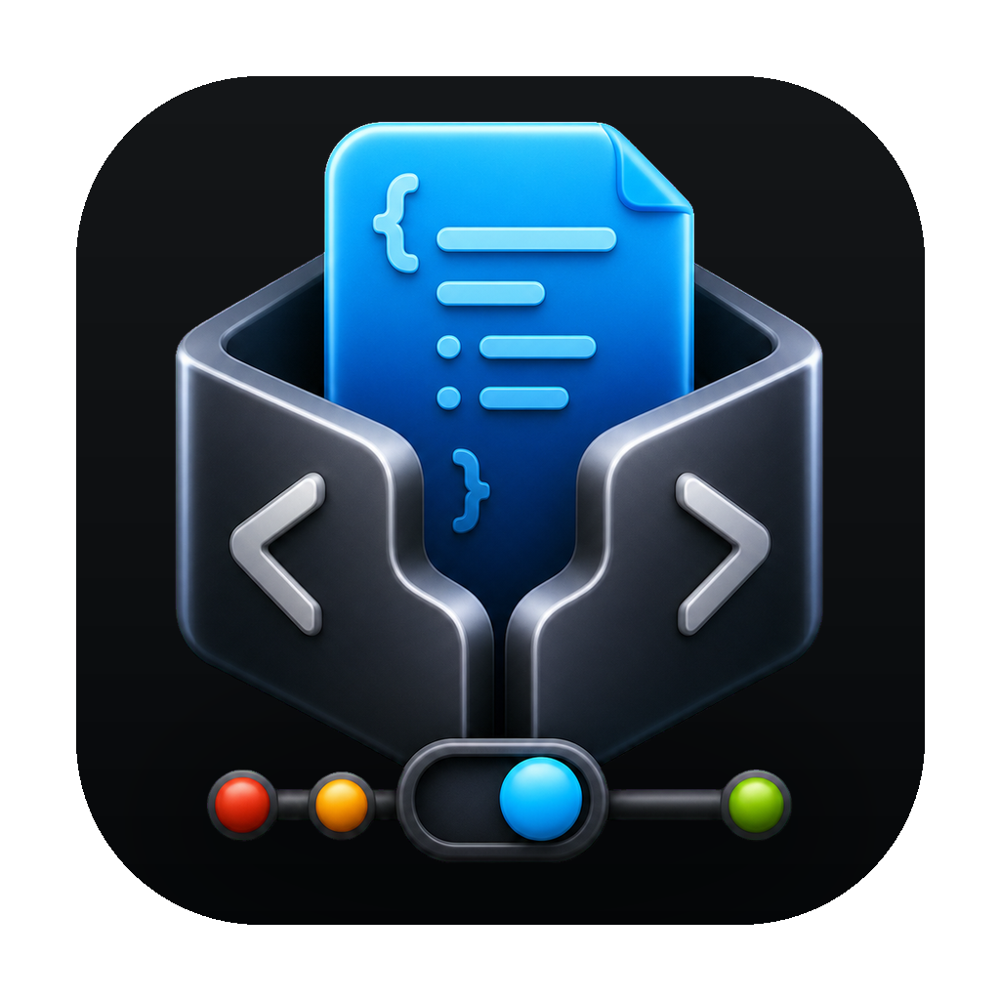

<p align="center">
  
</p>

<h1 align="center">MockKit</h1>

<p align="center">
  面向 Chrome DevTools Local Overrides 的 macOS 本机 Mock 工作台。
</p>

<p align="center">
  <a href="./README.md">English</a> ·
  <a href="https://github.com/zxpzdtom/MockKit/issues">问题反馈</a> ·
  <a href="./LICENSE">许可证</a>
</p>

MockKit 帮前端开发者把 Chrome Local Overrides 变成可管理的 Mock 工作区。它可以扫描 Overrides 文件夹、整理接口分组、为同一个接口维护多个返回场景，并把当前场景发布回 Chrome。

MockKit 不代理流量，也不会 hook `fetch` 或 `XMLHttpRequest`。它直接管理 Chrome Overrides 文件夹里的文件。

## 亮点

- **Chrome Overrides 工作区**：绑定、扫描、编辑和发布 Mock 文件。
- **接口业务分组**：树状目录和列表视图适合管理较大的 Overrides 文件夹。
- **多个返回场景**：同一个接口可以快速切换成功、失败、空数据等场景。
- **cURL 导入**：从浏览器或代理工具复制 cURL 后生成接口。
- **AI 辅助**：支持接口命名、响应生成和业务域自动分组。
- **中文 / 英文界面**：语言偏好保存在本机配置里。
- **主题预设**：基于 shadcn 风格 token 映射到 MockKit 界面变量。
- **CLI 支持**：在终端脚本里扫描、导入、编辑、切换场景、发布和禁用 Mock。
- **本地优先**：应用数据和 API Key 默认只保存在本机。

## 工作方式

MockKit 会在 Overrides 文件夹里写入一个隐藏 manifest：

```text
.mockkit-manifest.json
```

这个 manifest 用来记录 MockKit 管理过的文件，避免禁用或发布时误删同目录下的非托管文件。

开发示例默认使用：

```text
/Users/tom/Desktop/mock
```

你可以在 App 里选择其他 Overrides 文件夹。

## Chrome 设置

1. 打开 Chrome DevTools。
2. 进入 `Sources` -> `Overrides`。
3. 选择你的 Overrides 文件夹。
4. 允许 Chrome 访问该文件夹。
5. 使用 MockKit 扫描、编辑和发布返回场景。

Chrome Local Overrides 只有在当前页面打开 DevTools 时才会生效。

## 本地开发

```bash
pnpm install
pnpm dev
```

`pnpm dev` 会启动 Vite `http://127.0.0.1:5173`，并设置 `MOCKKIT_FRONTEND_DEV_SERVER` 后启动 macOS shell。前端改动会通过 Vite HMR 热更新，不需要反复重新打包 App。

Swift 或 Rust 改动仍然需要重启开发进程。

## CLI

开发时先构建 CLI：

```bash
cargo build
```

直接运行 debug binary：

```bash
./target/debug/mockkit status
./target/debug/mockkit list
./target/debug/mockkit show "example.com/api/users"
./target/debug/mockkit scan
./target/debug/mockkit publish
./target/debug/mockkit import-curl "curl 'https://example.com/api/users'"
./target/debug/mockkit use "example.com/api/users" "成功" --publish
./target/debug/mockkit disable "example.com/api/users" --publish
./target/debug/mockkit enable --matching "users" --publish
```

构建 App 后，打开 MockKit 并选择：

```text
MockKit -> Install Command Line Tool
```

新的终端窗口就可以直接运行：

```bash
mockkit status
mockkit list
mockkit show "example.com/api/users"
mockkit publish
mockkit use "example.com/api/users" "成功" --publish
```

常用选项：

```bash
mockkit --json status
mockkit --store ./store.json --overrides ./overrides scan
cat request.curl | mockkit import-curl --fetch
cat users.json | mockkit case update "example.com/api/users" "成功" --body-stdin --publish
```

CLI 默认读取和 App 相同的 store：

```text
~/Library/Application Support/MockKit/store.json
```

可以用 `--store`、`--overrides`、`MOCKKIT_STORE_PATH` 或 `MOCKKIT_OVERRIDES_FOLDER` 覆盖路径。

## 构建

```bash
pnpm install
pnpm mac:build
open dist/MockKit.app
```

Release 构建：

```bash
pnpm mac:build:release
```

## 项目结构

```text
Sources/ChromeOverridesManager/   macOS App shell 和内置前端资源
frontend/                         React UI、shadcn 风格组件、主题和 i18n
src/                              Rust 核心逻辑和 CLI
scripts/                          开发和 App 打包脚本
assets/                           App 图标和图标源文件
```

## 当前限制

- Chrome Overrides 匹配规则仍然遵循 Chrome 自己的行为。
- 状态码和响应头会保存在 App 模型里，但第一版发布路径以响应 body 为主。
- 同 URL 不同 HTTP Method 的请求，Chrome Overrides 可能无法区分。
- 发布场景后，页面可能需要刷新才会看到新响应。

## 许可证

MIT
